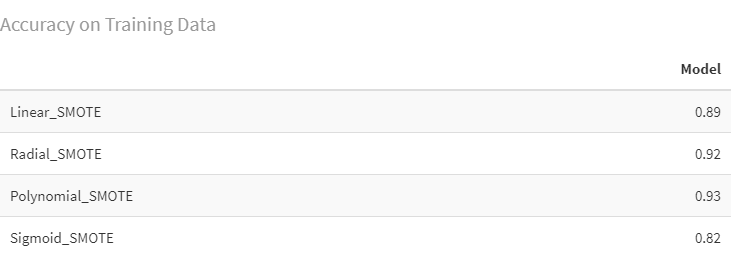

# Bank Marketing

***Classification problem to predict potential subscribers of a term deposit scheme for a Portuguese Bank***

 

## Introduction

Majority of the bank offer accounts where the owners can withdraw or deposit the money anytime. This makes it difficult for the banks to plan ahead of time about their lending power. To deal with this situation, banks introduced term deposit accounts where the money will be locked with the bank for a certain period of time. This gave the bank the flexibility to lend money forward. However, one of the major challenges is to identify customers who would be interested in subscribing for a term deposit.

## Problem Statement

I have a [dataset](https://archive.ics.uci.edu/ml/datasets/Bank+Marketing) of direct marketing campaigns run by a Portuguese banking institute. Our goal is to identify which of the customers have a higher chance of subscribing to the term deposit service before a sales rep makes a call to a potential customer. This will help the business reach out to a targeted list of customers having a higher chance of conversion . Furthermore, I looked into what features ascribe to potential subscribers.

## Approach

I used and compared two machine learning algorithms to solve this prediction challenge - SVM and Decision Trees. Decision Tree was also used to find the variable importance i.e. it helped  identify features that can be attributed to a potential subscriber.

### Data Exploration and Cleaning

*File : EDA_Preprocessing.R* 

**Key questions answered in this analysis:**

- Do people in certain jobs subscribe more?
- Are there certain months /days when people tend to subscribe more?
- What is the relationship subscription and Number of Contacts made during the Campaign? Also, do people who successfully converted to a previous campaign, are they potential subscribers for this one as well?
- How many missing values are there in the dataset? Are certain columns missing more values than others? What is the best strategy to handle them?
- Is the data balanced?

In this process, the data was cleaned, and missing values were treated, categorical columns were dummy encoded and data was divided 80% training set, 20% to testing set so that the it becomes ready for the next steps.

### Model Building

**Decision Tree**

*File : DecisionTree.R* 

Data is divided -- 80% training set, 20% to testing set.

Using the Decision Tree, we found the following features are most essential : 

Of these, we did not use the 'duration' column as this feature would be only know *after* a call is made to a customer and won't be useful in this prediction.

*Model Performance* 

**Support Vector Machine**

*File : SVM.R* 

- As I have about 49 columns after creation of dummy values, to visualize the data in 2 d space I have used **PCA**. As we can see from the plot below a lot of observations corresponding to “No” (0) is clustered towards the right side of the plot and “Yes” on the left but there are a huge number of observations which are not separable in 2-D space. Selecting an appropriate hyperplane seems difficult in 2-D space.

    

- **Kernel selection** : I used SVM function from the package e1071 and fit the balanced training data to different types of kernels – Linear, Radial, Polynomial and Sigmoid and evaluate performance. Accuracy measures for the different kernels are :

    

- The best performance is on **polynomial kernel,** I performed hyperparameter tuning of the C and degree parameters using 10 fold cross validation and grid search.

    *Model Performance :*

- Performance on Polynomial SVM model on test data (degree=3,c=1)

    

- AUC on test data

    

## Conclusion

Our goal is to identify people who will subscribe to the term deposit i.e. we are aiming for a high recall. The final model that I have selected is SVM. It has a high True positive rate (TPR) of 87.16%  and low false positive rate (FPR) of 14.5%. The value for precision is low due to the fact the positive class(1 or “Yes”) is in minority and even a small number of  false positives overwhelm the true positive and skew the precision calculation. Hence as evidenced by the AUC values, we can say that this model does a good job at identifying potential people who would subscribe to the term deposit.